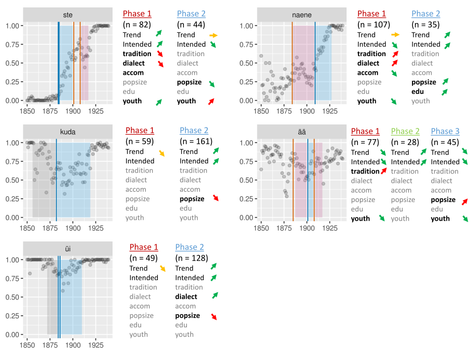

```{r setup, include=FALSE}
source("0_libraries.R")

library(zoo)

options(htmltools.dir.version = FALSE)
with_autor_data<-fread("../data/interim/with_autor_data_temp.tsv",sep="\t")
diffs<-fread("bookdown/diffs_temp.tsv",sep="\t")
diffs2<-fread("bookdown/diffs2_temp.tsv",sep="\t")

diffs2_m<-fread("bookdown/diffs2_m_temp.tsv",sep="\t")
diffs2_m[!is.na(pprescribed),prescribed:=pprescribed]

works <- fread("../data/processed/ERB_works_v_29.07.2018.tsv",sep="\t")
works[,aeg:=as.numeric(aeg)]

```

class: left, middle, inverse

## The question
<!-- there is a problem in linguistics --> 

- Can individuals change language? How much? When?
--

  - Language tends to live its own life.
--

  - (e.g. Berg & Aronoff 2017, Amato 2018)
--

- Historical sociolinguistics approach 
--

  - Language variation (color / colour)
  
--
  - Who did what when to whom, etc, as explanation
  
--
  - (e.g. Nevalainen & Raumolin-Brunberg 2012, Auer et al. 2015)
  
--

- Process of language standardization 

--

  - Written Estonian ~1880-1920
  
--

---

### Changes in linguistic variation

- Why do you use some linguistic form? <!-- (e.g. color/colour) - with some image mb..-->

--

  - Home dialect?
  
--

  - New friends in the city?
  
--

  - Traditions?
  
--

  - Dictionaries?
  
--

--

- Mechanisms of change

--

  - Influence of dictionaries/prescription?
  
--

  - Who are the early adopters?
  
--

  - Population turnover or a change for everyone?
  
--

<!-- [do the older people eventually change or simply stop writing...?]-->

---

class:  left

### Historical background 


- 1880-1920 in Estonia

--

  - Emerging writing community
  
--

  - In transition from a rural to a state language
  
--

  - Active effort in language standardization
  
--

  - Urbanization, migration between dialects

---
class: left

## An emerging community 


<!--funded by the users etc --> 

```{r makesimple histogram,echo=F,warning=F}
p<- works[aeg< 2020&aeg>1700] %>%
  ggplot(aes(x=aeg))+
  geom_histogram(binwidth=1) + 
  annotate("rect", xmin=1880, xmax=1920, ymin=0, ymax=1000, alpha=0.2, fill="orange") +
  #geom_rect(aes(xmin=1880,xmax=1920,ymin=0,ymax=1000),alpha=0.3,fill="orange")+
  theme_bw()+
  labs(title="Number of publications per year",ylab="",xlab="")


  
```


```{r preprocessing genres,results=F,eval=T, echo=F,warning=F}


works[,decade:=floor(aeg/10)*10]

#old2 has only uniques
genres <- works[,.(genre=unlist(str_split(genres,"\\$a"))),by=.(RRid,aeg,comptitle,genres,meta_eks2)][genres!=""&genre!=""&!is.na(genre)|genres==""|is.na(genres)][order(aeg)][,genre:=trimws(str_replace_all(genre,"\\.",""))]#[,.N,by=V1][order(-N)], excludes the one with zero genre

genrelist <- genres[,.N,by=genre][order(-N)]
nrow(genrelist) #unique genres


#check for common topics with the help of genrelist
#genres[str_detect(genre,"jutluse"),unique(genre)]

genres[str_detect(genre,"vaimulik"),relig:="relig"]
genres[str_detect(genre,"hardus"),relig:="relig"]
genres[str_detect(genre,"katekism"),relig:="relig"]
genres[str_detect(genre,"palve"),relig:="relig"]
genres[str_detect(genre,"evange"),relig:="relig"]
genres[str_detect(genre,"jutluse"),relig:="relig"]

genres[str_detect(genre,"laul"),laul:="laul"]

genres[str_detect(genre,"jutustus"),iluk:="iluk"]
genres[str_detect(genre,"romaan"),iluk:="iluk"]
genres[str_detect(genre,"^ilukirj"),iluk:="iluk"] #include vaimulik? not now
genres[str_detect(genre,"novell"),iluk:="iluk"]
genres[str_detect(genre,"jutud"),iluk:="iluk"]
genres[str_detect(genre,"antoloogiad"),iluk:="iluk"]


genres[str_detect(genre,"kalend"),kalend:="kalend"]


genres[str_detect(genre,"kooli"),haridus:="haridus"]
genres[str_detect(genre,"bukoolika"),haridus:=NA]
genres[str_detect(genre,"aab"),haridus:="haridus"]
genres[str_detect(genre,"õppe"),haridus:="haridus"]
genres[str_detect(genre,"õpik"),haridus:="haridus"]
genres[str_detect(genre,"töövih"),haridus:="haridus"]
genres[str_detect(genre,"õppekav"),haridus:="haridus"]
genres[str_detect(genre,"ülesanded"),haridus:="haridus"]
genres[str_detect(genre,"lugemikud"),haridus:="haridus"]
genres[str_detect(genre,"loeng"),haridus:="haridus"]
genres[str_detect(genre,"kontrolltööd"),haridus:="haridus"]


genres[str_detect(genre,"käsiraa"),juhend:="juhend"]
genres[str_detect(genre,"juhen"),juhend:="juhend"]
genres[str_detect(genre,"nõuand"),juhend:="juhend"]

genres[str_detect(genre,"luule"),luule:="luule"]
genres[str_detect(genre,"bukoolika"),luule:="luule"]

genres[str_detect(genre,"kodukor"),bürokr:="bürokr"]
genres[str_detect(genre,"põhikir"),bürokr:="bürokr"]
genres[str_detect(genre,"seltsid$"),bürokr:="bürokr"]
genres[str_detect(genre,"eeskirjad"),bürokr:="bürokr"]
genres[str_detect(genre,"üleskutsed"),bürokr:="bürokr"]
genres[str_detect(genre,"seadus"),bürokr:="bürokr"]
genres[str_detect(genre,"õigus"),bürokr:="bürokr"]
genres[str_detect(genre,"aruanded"),bürokr:="bürokr"]
genres[str_detect(genre,"stenogrammid"),bürokr:="bürokr"]
genres[str_detect(genre,"otsused"),bürokr:="bürokr"]
#genres[str_detect(genre,"poliit"),unique(genre)]


genres[str_detect(genre,"mäng"),mäng:="mäng"]

genres[str_detect(genre,"tants"),tants:="tants"]

genres[str_detect(genre,"laste"),lastenoorte:="lastenoorte"]
genres[str_detect(genre,"pildi"),lastenoorte:="lastenoorte"]
genres[str_detect(genre,"värvi"),lastenoorte:="lastenoorte"]
genres[str_detect(genre,"noorsoo"),lastenoorte:="lastenoorte"]

genres[str_detect(genre,"näide"),näidend:="näidend"]

genres[str_detect(genre,"biogra"),biogr:="biogr"]

genres[str_detect(genre,"reisikirj"),reis:="reis"]
genres[str_detect(genre,"reisi"),reis:="reis"]

genres[str_detect(genre,"teatm"),teatm:="teatm"]
genres[str_detect(genre,"aimekirj"),teatm:="teatm"]
genres[str_detect(genre,"nimest"),teatm:="teatm"]
genres[str_detect(genre,"biblio"),teatm:="teatm"]


#genres[str_detect(genre,"loogia"),unique(genre)]
genres[str_detect(genre,"teadus"),teadus:="teadus"]
genres[str_detect(genre,"labori"),teadus:="teadus"]
genres[str_detect(genre,"tees"),teadus:="teadus"]
genres[str_detect(genre,"kogumikud"),teadus:="teadus"]
genres[str_detect(genre,"separaa"),teadus:="teadus"]

genres[str_detect(genre,"kataloog"),kataloog:="kataloog"]

genres[str_detect(genre,"kokaraamatud"),toit:="toit"]
genres[str_detect(genre,"toid"),toit:="toit"]

genres[,genre_standardized:=str_replace_all(paste(relig,laul,iluk,kalend,haridus,juhend,luule,bürokr,mäng,tants,lastenoorte,näidend,biogr,reis,teatm,teadus,kataloog,toit,sep=" "),"NA","")]
genres[,decade:=floor(aeg/10)*10]
genres[,decade2:=(floor(aeg/20)*20)+10] #center in the middle for the plot
genres_st <-genres[,.(genres_all=paste(genre_standardized,sep=" ",collapse= " ")),by=.(RRid,aeg,decade,decade2,comptitle,genres,meta_eks2)]
genres_st[,genres_all:=paste(unique(unlist(str_split(trimws(genres_all)," "))),sep="",collapse= " "),by=.(RRid,aeg,decade,decade2,comptitle,genres,meta_eks2)]
#genres_st[101,trimws(genres_all)]
genres_melt <-  genres_st[,.(genre_uniques=unlist(str_split(genres_all, " "))), by=.(RRid,aeg,decade,decade2,comptitle,genres,meta_eks2)]
#hacky
genres_melt[,n_genres:=.N,by=.(RRid,aeg,decade,comptitle,genres,meta_eks2)]
genres_melt <- genres_melt[!(n_genres>1&genre_uniques=="")][order(aeg)]
genres_melt[,n_genres:=.N,by=.(RRid,aeg,decade,comptitle,genres,meta_eks2)]


nrow(genres_melt[genre_uniques=="iluk"][aeg>1880&aeg<1920])
#should check this against the corpus too...
#print numbers of each of the genres matter for dominance of linguistic parameters...

genres_melt[,totalsum:=.N,genre_uniques]
#genres_melt[order(-totalsum),genre_uniques:=factor(genre_uniques,levels=unique(genre_uniques))]

genre_by_time <- genres_melt[,.N,by=.(totalsum,decade2,genre_uniques)][,prop:=N/sum(N),by=.(decade2)][order(-totalsum)][,genre_uniques:=factor(genre_uniques,levels=unique(genre_uniques))]
cbbPalette <- c("#000000", "#E69F00", "#56B4E9", "#009E73", "#F0E442", "#0072B2", "#D55E00", "#CC79A7")
morecolours <- c("#8dd3c7","#ffffb3","#bebada","#fb8072","#80b1d3","#fdb462","#b3de69","#fccde5","#d9d9d9","#bc80bd","#ccebc5","#ffed6f")

px<- genre_by_time[decade2>1700&decade2<2000] %>%
  ggplot(aes(x=decade2,fill=genre_uniques,y=prop))+geom_bar(stat="identity")+
  theme_bw()+
  scale_fill_manual(values=c(cbbPalette,morecolours,cbbPalette))

#ggplotly(p)

grid_expanded <- expand.grid(x=unique(genre_by_time[!is.na(decade2)&decade2!="20162000"]$decade2),y=unique(genre_by_time[!is.na(decade2)]$genre_uniques))
names(grid_expanded) <- c("decade2","genre_uniques")
merged <-unique(merge(genre_by_time,grid_expanded,by=c("decade2","genre_uniques"),all=T))
merged[is.na(prop),prop:=0]
genre_by_time <- merged


    
```

.pull-left2[

```{r print the histogram, echo=F,warning=F}

#gridExtra::grid.arrange(p,p2,ncol=2)
p

```


]

.pull-right2[

```{r print the genres, echo=F,warning=F,fig.asp=0.8}
p2 <- genre_by_time[decade2>1800&decade2<2000] %>%
  ggplot(aes(x=decade2,fill=genre_uniques,y=prop))+
  geom_area(position='stack')+
  theme_bw()+
  annotate("rect", xmin=1880, xmax=1920, ymin=0, ymax=1, alpha=0.2, fill="red") +
  scale_fill_manual(values=c(cbbPalette,morecolours,cbbPalette))+
  theme(legend.key.size = unit(0.5, "cm"))+
  labs(title="Mixture of genres over time",ylab="",xlab="")+
  guides(fill=guide_legend(title="Genres"))

#gridExtra::grid.arrange(p,p2,ncol=2)
p2

```

]


```{r corpus notes, echo=F, warning=F}
#corpus notes

#proportion of genre ilukirjandus töödest is actually more relevant than all texts,
#just take out the ilukirjandus part there,,,
#or maybe the part with wide enough ekspemplari circulations

#since it can be expected that põhikirjad did not have that much of a role in there...
```


---

## Variation in corpora

<!---2 competing forms: e.g. nõu & nõuu [ *advice* ]--->

```{r, echo=F,warning=F,message=F, fig.width=8,fig.height=6}
#üks näidisgraafik.


#nrow(genres_melt[genre_uniques=="iluk"][aeg>1880&aeg<1920])

p1<-diffs%>%filter(collection=="vanakorp"&decade<1919)%>%filter(variable=="õuu")%>%
  ggplot(aes(x=aeg,y=value, text =paste0("title:", Nime.normitud.kuju, "\ntitle:", comptitle, "\n", value, "\n", value_uniques)))+
  geom_jitter(alpha=0.2)+
  #stat_smooth(method="gam", formula = y ~ s(x, k = 5), size = 1)+
  facet_wrap(~variable)+
  labs(title=paste0("õuu/õu in time"))

p2<-diffs%>%filter(aeg>1890&aeg<1930)%>%filter(variable=="õuu")%>%group_by(aeg,variable) %>% summarise(V1=mean(value,na.rm=T))%>%
  ggplot(aes(x=aeg,y=V1))+
  geom_point(alpha=0.2)+
  stat_smooth(se = FALSE)+
  #stat_smooth(method="gam", formula = y ~ s(x, k = 5), size = 1)+
  facet_wrap(~variable)+
  labs(title=paste0("õuu/õu in time"))


s1 <-ggplotly(p1)
s2 <-ggplotly(p2)

subplot(s1,s2)


```


---

## A balanced corpus

<!--- UT corpus
- Snippets from ~100 texts per decade
- 1890s, 1900s, 1910s--->

```{r simple vanakorp, echo=F,warning=F}
var <- colnames(with_autor_data)[30:46]
var2 <- var[c(1:4,6:13,15:17)]
var2_seq <- var2[c(1,11,12,8,5,9,4,3,6,2,14,13,10,7,15)]
var3 <- colnames(with_autor_data)[47:63]
var4 <- var3[c(1:4,6:13,15:17)]
var4_seq <- str_replace(var4[c(1,11,12,8,5,9,4,3,6,2,14,13,10,7,15)],"_uniques","")


#p<- melt(with_autor_data,id.vars = c("decade","RRid","collection"),measure.vars=var2)%>%mutate(variable=factor(variable,levels=var2_seq))%>%filter(collection=="vanakorp"&decade<1919)%>%mutate(Ww_var=NA)%>%filter(!variable%in%c("nnud_var","om_var","herra_var"))%>%#filter(variable!="Ww_var")%>%
p <- diffs%>%mutate(variable=factor(variable,levels=var4_seq))%>%filter(collection=="vanakorp"&decade<1919)%>%filter(!variable%in%c("nnud","om","herra"))%>%
  group_by(decade,variable)%>%summarise(mean=mean(value,na.rm=T))%>%mutate(variable=factor(variable,levels=var4_seq))%>%
  ggplot(aes(x=decade,y=mean))+
  geom_bar(alpha=0.8,stat="identity")+
  #stat_smooth(method="gam", formula = y ~ s(x, k = 5), size = 1)+
  facet_wrap(~variable)+
  #labs(title=paste0("Variation of ",var[i]))+
  theme_bw()

#ggplotly(p)
p

```

---

## Corpus in detail

<!-- so, while balanced corpora are nice, what we'd like in historical sociolinguistics is like this --> 
<!-- - and when we consider the set of texts, the balancing really does not give us much,
- could possibly connect with line vanakorp if author is the same??? --> 

```{r detailed vanakorp, echo=F,warning=F}

p <-diffs%>%mutate(variable=factor(variable,levels=var4_seq))%>%filter(collection=="vanakorp"&decade<1919)%>%filter(!variable%in%c("nnud","om","herra"))%>%#filter(variable!="Ww_var")%>%
  ggplot(aes(x=aeg,y=value, text =paste0("title:", Nime.normitud.kuju, "\ntitle:", comptitle, "\n", value, "\n", value_uniques)))+
  geom_point(alpha=0.2)+
  #stat_smooth(method="gam", formula = y ~ s(x, k = 5), size = 1)+
  facet_wrap(~variable)#+
  #labs(title=paste0("Variation of selected"))
ggplotly(p)
```

---

class: left

## Making use of digitized texts

- Gathered available texts (for period 1800-1940)

--

  - Digar, Literary Museum, E-books, Wikisource, Dspace etc

--

- Vary in quality and amount of editing

--

- Add metadata (Est. National Bibliography, ISIK biographical database)

--

- Usefulness of some text may vary in purpose

--

  - E.g. OCR not good for general patterns but quite ok for spelling variation
  
--
  
  - On the other hand, edited texts may be unsuitable


---

## Collection overview

```{r corpus in context, echo=F,warning=F,message=F,fig.width=10}
#,fig.asp=0.5

set_unique<-fread("bookdown//set_unique_temp.tsv",sep="\t")  


old2<- fread("old2_ERB_temp.tsv",sep="\t")
old2_unique <- unique(old2[,.(aeg,RRid)])

p1 <- set_unique[,.N,by=aeg][,set:="corpus"] %>%
#rbind(old2_unique[,.N,by=aeg][,set:="totals"]) %>%
  ggplot(aes(x=aeg,y=N,fill=set))+
  geom_bar(stat="identity",position="dodge")+
  scale_fill_manual(values=c("black","grey"))+
  theme_bw()+
  labs(title="Texts in corpus by year",ylab="",xlab="")

  


p2 <- set_unique[,.N,by=aeg][aeg>1880&aeg<1921][,set:="corpus"] %>%
rbind(old2_unique[,.N,by=aeg][aeg>1880&aeg<1921][,set:="totals"]) %>%
  ggplot(aes(x=aeg,y=N,fill=set))+
  geom_bar(stat="identity",position="dodge")+
  scale_fill_manual(values=c("black","grey"))+
  theme_bw()+
  labs(title="Texts in corpus vs texts published",ylab="",xlab="")

  
gridExtra::grid.arrange(p1,p2,nrow=1,ncol=2)

#p1

#p2


#Eesti is correct now, there's no information on cities on Eesti examples
#see2 <- less[str_detect(koht,"Eesti")]
#see <- set_unique[!is.na(koht)&koht!=""][,.N,by=koht]

   

```


```{r, echo=F,warning=F,message=F}

transitions <- data.table(diffs2)[order(aeg)][,previtem:=lag(value),by=.(variable,Nime.normitud.kuju)][,decade:=round(aeg/10,0)*10]

transitions[,firstbookincluded:=min(aeg),by=Nime.normitud.kuju]
transitions[,decade_started:=round(firstbookincluded/10,0)*10,by=Nime.normitud.kuju]
transitions2 <- transitions[decade_started+10>aeg]

```


---

## Metainformation on items

National Library Open Data (data.digar.ee !)

Estonian National Bibliography
- publisher, city, date
- author, birthdates
- print numbers/script, sometimes
- genre
- topics
- etc

<center></center>

<!--- years of work, or even generations, when counting the many bibliographies that have been used for it. {:height="50%" width="50%"}
- what is now great though, is that it is added together in one place...-->

---

## Metainformation on items

```{r, echo=F,warning=F,fig.width=10,eval=T}

#fwrite(set_unique,"set_unique_temp.tsv",sep="\t")

# set_unique<-fread("bookdown//set_unique_temp.tsv",sep="\t")  
# 
# p3<- set_unique[!is.na(autor_name)&autor_name!=""][,.N,by=autor_name][,.(nn=.N),by=N][order(N)][N>9,nn:=sum(nn)][N<11][,N:=factor(N,levels=unique(N))] %>%#
#     ggplot(aes(y=nn,x=N))+
#     geom_bar(stat="identity",position="dodge")+
#     coord_flip()+
# #  coord_cartesian(ylim=0,200)+
#     theme_bw()+
#   labs(x="Teoseid",y="Autoreid")+
#     NULL
#   

#diffs2_m[,.SD[1],by=.(comptitle,autor_id)]
#plotdata_autorid <- diffs2_m[aeg>1879&aeg<1921][,.SD[1],by=RRid]
plotdata_autorid <- diffs2_m[aeg>1879&aeg<1921][,.SD[1],by=RRid][,.SD[1],by=.(comptitle,autor_id)][!is.na(autor_id)&autor_id!=""][,.N,by=autor_id][order(N)][,autor_id:=factor(autor_id,levels=unique(autor_id))][N>7]
p3<- plotdata_autorid %>%
    ggplot(aes(y=N,x=autor_id))+
    geom_bar(stat="identity",position="dodge")+
    geom_text(data=plotdata_autorid[(nrow(plotdata_autorid)-1):nrow(plotdata_autorid)], aes(label=N),size = 3, position = position_stack(vjust = 1.05))+
    geom_text(data=plotdata_autorid[!(nrow(plotdata_autorid)-1):nrow(plotdata_autorid)],aes(label=N),size = 3, hjust = -0.5)+# )+
    #coord_cartesian(ylim=c(0,2700))+
    coord_flip()+
    theme_bw()+
    NULL


#all cities with more than 10 books in corpus
plotdata_kohad <- diffs2_m[aeg>1879&aeg<1921][,.SD[1],by=RRid][,.SD[1],by=.(comptitle,autor_id)][!is.na(koht)&koht!=""][,.N,by=koht][order(N)] [,koht:=str_replace(koht,"%20linn|%20alev","")][,koht:=factor(koht,levels=unique(koht))][N>9]
p4<-plotdata_kohad %>%
    ggplot(aes(y=N,x=koht))+
    geom_bar(stat="identity",position="dodge")+
    geom_text(data=plotdata_kohad[(nrow(plotdata_kohad)-1):nrow(plotdata_kohad)], aes(label=N),size = 3, position = position_stack(vjust = 1.05))+
    geom_text(data=plotdata_kohad[!(nrow(plotdata_kohad)-1):nrow(plotdata_kohad)],aes(label=N),size = 3, hjust = -0.5)+# )+
    #coord_cartesian(ylim=c(0,2700))+
    coord_flip()+
    theme_bw()+
    NULL
   
gridExtra::grid.arrange(p3,p4,nrow=1,ncol=2)


```


---

## Metainformation on people


<!--- can make it into list of activities.--->

---

### Placename database

<!--Place name database at Estonian langauge institute,- also has a query system----->


---

### Merging the information


```{r get data , echo=F,warning=F,message=F,results='hide'}

nc2 = st_read("../data/external/kih1897m_region.shp", stringsAsFactors = FALSE)

```

```{r travel and age, echo=F,warning=F,message=F, fig.height=7,fig.width=9.5}

#installed https://github.com/IRkernel/repr
#following https://github.com/ropensci/plotly/issues/1104
#to get plotly properly working, otherwise was really slow

nc3 <- st_transform(nc2, 4326) %>% 
  st_transform(., '+proj=longlat +ellps=GRS80 +no_defs')

#fwrite(merged_coords_ISIK_corp,"merged_coords_ISIK_corp_temp.tsv",sep="\t")

merged_coords_ISIK_corp<- fread("bookdown/merged_coords_ISIK_corp_temp.tsv",sep="\t")
#also jitter here
merged_coords_ISIK_corp[,factor_name:=as.numeric(as.factor(ISIK.id))]
merged_coords_ISIK_corp[,color_nr:=factor_name %% 8]
merged_coords_ISIK_corp[,beginyear:=as.numeric(beginyear)]

#summary(merged_coords[,.(beginyear)])
#summary(merged_coords[,.(endyear)])
#merged_coords[endyear>2000]
#merged_coords[is.na(endyear)]

forplot <- merged_coords_ISIK_corp[!is.na(endyear),.(year=unlist(beginyear:endyear),episode=paste0(unique(episode2))),by=.(places,ISIK.id,Nime.normitud.kuju,lon2,lat2,beginyear,endyear,color_nr)][,rnorm:=rnorm(1,0)/10,by=.(places,Nime.normitud.kuju,lat2,lon2)][,rnorm2:=rnorm(1,0)/10,by=.(places,Nime.normitud.kuju,lat2,lon2)][!is.na(year)][,.SD[1],by=.(year,ISIK.id)] #taking just the first one removes 1/3 of dataset


#forplot[episode=="synd"]
forplot[,birthyear:=min(year),by=ISIK.id]
forplot[,age:=year-birthyear]

events_sf <- forplot[!is.na(lat2)] %>%
  #now adding jitter here too, might be a bit more in fact in these coordinates mb
  mutate(lon2_jit=lon2+rnorm,lat2_jit=lat2+rnorm2)  %>%
  st_as_sf(coords = c("lon2_jit", "lat2_jit"), crs = 4326)


events_nc3 <- st_transform(events_sf, 4326) %>% 
  st_transform(., '+proj=longlat +ellps=GRS80 +no_defs')# %>%
res <- st_join(events_nc3, nc3)
res <-
  res %>%
  mutate(color_nr=factor(color_nr)) %>%
  filter(year<1930&year>1800)# %>%


p <- ggplot() +
  geom_sf(data=nc3,aes(),alpha=0.1) +
  #geom_sf(data=events_sf) +
  geom_sf(data=res,aes(text=paste(Nime.normitud.kuju,"<br>",episode,"<br>",KIHELKOND,"<br>",MAAKOND),frame=year,ids=ISIK.id,color=age)) +
  #coord_sf(crs = 4326, datum = NA) +
  #scale_fill_distiller("Area", palette = "Greens") +
  ggtitle("Korpuse autorite elukäik") +
  #facet_wrap(~year)+
  coord_fixed(ratio=3.5/2)+ #
  scale_color_gradient2( low = muted("green"), mid = "yellow",
                         high = muted("red"), midpoint = 35, space = "Lab",
                         na.value = "grey50", guide = "colourbar")+
  theme_bw()

ggplotly(p)%>%animation_opts(frame = 300,
                       easing = "linear",
                       redraw = FALSE)

```

(Map, Laineste 1997)

---

### Dialect areas

```{r,echo=F,warning=F,results='hide'}

nc2 = st_read("../data/external/kih1922_region.shp", stringsAsFactors = FALSE)

nc3 = st_read("../data/external/vald1922_region.shp", stringsAsFactors = FALSE)
#on kõik vallad ja maakonnad siin...

koordinaadid <- fread("../data/external/murdealadeKoordinaadid.csv", header=T, sep=";")
nc2 <- st_transform(nc2, 4326) %>% 
  st_transform(., '+proj=longlat +ellps=GRS80 +no_defs')
nc3 <- st_transform(nc3, 4326) %>% 
  st_transform(., '+proj=longlat +ellps=GRS80 +no_defs')


events_sf <- koordinaadid[!is.na(lon)] %>%
  st_as_sf(coords = c("lon", "lat"), crs = 4326)
events_nc3 <- st_transform(events_sf, 4326) %>% 
  st_transform(., '+proj=longlat +ellps=GRS80 +no_defs')

df <- data.frame(lon=c(119.4,119.4,119.4,119.5,119.5), 
                 lat=c(-5.192,-5.192,-5.187,-5.187,-5.191))
df <- rbind(df, df[1,])
poly <- st_sf(st_sfc(st_polygon(list(as.matrix(df)))), crs = 4326)
poly

koordinaadid[,polygon:=NA]
koordinaadid <- koordinaadid[!is.na(lat)]

for (i in 1:15){
latlon <- koordinaadid[is.na(polygon)][lat==lat[1]&lon==lon[1]&murre==murre[1]]
koordinaadid[lon==latlon[,lon[1]]&lat==latlon[,lat[1]]&murre==latlon[,murre[1]],polygon:=paste0("polygon",i)]
koordinaadid <- na.locf(koordinaadid,fromLast = T)
}
koordinaadid[,lat:=as.numeric(lat)]
koordinaadid[,lon:=as.numeric(lon)]
koordinaadid[murre=="v\xf5ru",murre:="võru"]
koordinaadid[murre=="l\xe4\xe4ne",murre:="lääne"]
murre_ids <- unique(koordinaadid[,.(polygon,murre)])

murre_polygons <- koordinaadid[!is.na(lat)]%>%
  st_as_sf(coords = c("lon", "lat"), dim = "XY") %>% st_set_crs(4326) %>% 
  group_by(polygon) %>%
  summarise(geometry = st_union(geometry), do_union = F) %>% st_cast("POLYGON") %>%
  merge(murre_ids,on="polygon") %>% 
  st_transform(., '+proj=longlat +ellps=GRS80 +no_defs')
  #st_cast("MULTILINESTRING") %>% st_cast("MULTIPOLYGON")

#murre_polygon

```


```{r plot dialects, echo=F, warning=F, fig.height=5.5,fig.width=9.5}

p<-ggplot() +
  #geom_sf(data=events_sf) +
  geom_sf(data=nc3,aes(text=paste0(VALD,"<br>",MAAKOND),alpha=0.01,fill="grey")) +
  #geom_sf(data=unused_murre_joined,aes(colour=murre,fill=murre),alpha=0.2) + #,fill=murre
  geom_sf(data=murre_polygons,aes(fill=murre),alpha=1) +
  #scale_fill_distiller("Area", palette = "Greens") +
  ggtitle("Predicted variant used") +
  coord_fixed(ratio=3.5/2)+
  theme_bw()
ggplotly(p)
```

(Uiboaed & Kyrolainen 2015)

---

### Predicting writing from dialect

```{r predictions murre, echo=F,warning=F,message=F, fig.height=5.5,fig.width=9}
#write_csv(merged_murr,"merged_murr.tsv")
merged_murr<- data.table(read_csv("merged_murr.tsv"))
merged_murr[,V7:=tolower(V7)]
merged_murr[V7=="alutaguse",V7:="kirde"]

# predictions_murre<-merged_murr[,median(mean),by=.(V7,type)][type%in%c("ää","om","ste","naene","üi")][,type:=factor(type,levels=c("ää","om","ste","naene","üi"))]%>%
#   ggplot(aes(x=type,y=V7))+
#   geom_tile(aes(fill=V1))+
#   scale_fill_gradient2( low = "darkred", mid = "yellow",
#                          high = "darkgreen", midpoint = 0.5, space = "Lab",
#                          na.value = "grey50", guide = "colourbar")+
#   scale_alpha(range=c(0,1), limits=c(1,1), na.value = 0)+
#   theme_bw()+
#   labs(x="",y="")

merged_wmap <- data.table(merge(murre_polygons,merged_murr[,median(mean),by=.(V7,type)][type%in%c("ää")],by.x="murre",by.y="V7"))
merged_wmap[V1==1,variant:="ea"]
merged_wmap[V1==0,variant:="ää"]
#ggplotly(predictions_murre)

p<-ggplot() +
  #geom_sf(data=events_sf) +
  geom_sf(data=nc3,aes(text=paste0(MAAKOND)),alpha=0.01) +
  #geom_sf(data=unused_murre_joined,aes(colour=murre,fill=murre),alpha=0.2) + #,fill=murre
  #geom_sf(data=murre_polygons,aes(fill=murre),alpha=1) +
  geom_sf(data=merged_wmap,aes(fill=variant,)) +
  scale_fill_manual(values=c("#D55E00","#009E73")) +
  ggtitle("Mean area by group") +
  coord_fixed(ratio=3.5/2)+
  theme_bw()
ggplotly(p)

```

(Uiboaed & Kyrolainen 2015)

---
class: inverse, humanities-slide 
## Sources on grammars


---

## Corpus results

<!---So altogether, referring to the previous available corpus we get a more complete picture,
with some nice trends in there...

first img of old picture,

then img of new picture of averages...--->


```{r simple vanakorp2, echo=F,warning=F}
var <- colnames(with_autor_data)[30:46]
var2 <- var[c(1:4,6:13,15:17)]
var2_seq <- var2[c(1,11,12,8,5,9,4,3,6,2,14,13,10,7,15)]
var3 <- colnames(with_autor_data)[47:63]
var4 <- var3[c(1:4,6:13,15:17)]
var4_seq <- str_replace(var4[c(1,11,12,8,5,9,4,3,6,2,14,13,10,7,15)],"_uniques","")


p<- melt(with_autor_data,id.vars = c("decade","RRid","collection"),measure.vars=var2)%>%mutate(variable=factor(variable,levels=var2_seq))%>%filter(collection=="vanakorp"&decade<1919)%>%mutate(Ww_var=NA)%>%filter(!variable%in%c("nnud_var","om_var","herra_var"))%>%#filter(variable!="Ww_var")%>%
  group_by(decade,variable)%>%summarise(mean=mean(value,na.rm=T))%>%mutate(variable=factor(variable,levels=var2_seq))%>%
  ggplot(aes(x=decade,y=mean))+
  geom_bar(alpha=0.8,stat="identity")+
  #stat_smooth(method="gam", formula = y ~ s(x, k = 5), size = 1)+
  facet_wrap(~variable)+
  #labs(title=paste0("Variation of ",var[i]))+
  theme_bw()

#ggplotly(p)
p

```


---

## Corpus results

```{r average uuskorp, echo=F,warning=F,message=F}

diffs2%>%group_by(aeg,variable) %>% summarise(V1=mean(value,na.rm=T))%>%mutate(variable=factor(variable,levels=var4_seq))%>%filter(!variable%in%c("nnud","om","herra"))%>%
  ggplot(aes(x=aeg,y=V1))+
  geom_point(alpha=0.2)+
  #stat_smooth(method="gam", formula = y ~ s(x, k = 5), size = 1)+
  coord_cartesian(ylim=c(0,1))+
  facet_wrap(~variable)#+
  #labs(title=paste0("Variation of all"))
```


```{r detailed uuskorp, echo=F,warning=F,message=F,eval=F}


p<- diffs2%>%mutate(variable=factor(variable,levels=var4_seq))%>%filter(!variable%in%c("nnud","om","herra")) %>%
  #filter(!RRid%in%duplicate_ids)   %>%
  #mutate(variable=as.character(variable))%>%
  #filter(decade==1880)%>%
  ggplot(aes(x=aeg,y=value,text=paste0(collection,"<br>",comptitle,"<br>",Nime.normitud.kuju,"<br>",value_uniques)))+
  geom_point(stat="identity",alpha=0.2)+
  #geom_rect(aes(xmin=1880,xmax=1920,ymin=0,ymax=1),fill="orange",alpha=0.02)+
  geom_line(aes(group=RRid))+
  #stat_smooth()+
  facet_wrap(~variable)

#ggplotly(p)
p


```


---

<!--And in addition to that 

so we have some nice changes,

why did they happen, well the first question we want - 

can they be associated with intentional activities,

picture adding together with prescription,,


and indeed it looks like they can, in fact in many occasions these lines are even exact turning points in usage...--->

## Prescription data

```{r prescription data, echo=F,warning=F}
prescriptions <- fread("../data/raw/prescriptions_database.csv",sep="\t", na.strings=c("","NA"))
#unique(save[comments!="SKIP",.(year,variable,direction,standardized)])
prescriptions <- prescriptions[is.na(skip)]
prescriptions <- na.locf(prescriptions)


#prescriptions[year==1901]
#prescriptions[variable=="ää"]


#unique(prescriptions$variable)

#prescriptions[variable%in%c("ää","auu","ste","te","herra","ial","kuda","käsa","eila","naene","õuu","üi","Ww")]

save <-prescriptions[variable%in%c("ää","auu","ste","te","herra","ial","kuda","käsa","eila","naene","õuu","üi","Ww")]


#1886 mixed type can be good too, can't distinguish au and auu...
#1908 - some particular words as exceptions, can check for them or smth..
#save[standardized=="EXCEPTION",.(year,variable,advice,direction,standardized)]

#save[standardized=="ALL",.(year,person,variable,direction,standardized)]
save[direction=="standard",value:=1]
save[direction=="nonstandard",value:=0]

prescription_data<-unique(save[standardized=="ALL",.(year,person,variable,direction,standardized,value)])[standardized=="ALL",.(value=mean(value,na.rm=T)),by=.(year,variable)][!value%in%c(0,1),value:=NA]


```

```{r plot w prescription, echo=F,warning=F}

diffs2%>%group_by(aeg,variable) %>% summarise(V1=mean(value,na.rm=T))%>%mutate(variable=factor(variable,levels=var4_seq))%>%filter(!variable%in%c("nnud","om","herra"))%>%
  ggplot(aes(x=aeg,y=V1))+
  geom_point(alpha=0.2)+
  geom_vline(data=prescription_data%>%filter(!variable%in%c("nnud","om","herra"))%>%mutate(variable=factor(variable,levels=var4_seq)),aes(xintercept=as.numeric(year),colour=factor(value)))+
  #stat_smooth(method="gam", formula = y ~ s(x, k = 5), size = 1)+
  coord_cartesian(ylim=c(0,1))+
  facet_wrap(~variable)+
  #labs(title="")+
  scale_colour_manual(name = "Intention",
                     values = c("0" = "#D55E00",
                                  "1" = "#0072B2",
                                  "NA" = "#000000"),
                     labels = c("Down", "Up", "Mixed"))+
  guides(colour=FALSE)

```


---

## Phases of the change 

<!--- so, we can zoom in the areas where there seems to be directed changes, like the ones here...
and image with trends too maybe?--->


```{r plot w phases, echo=F,warning=F}


diffs2_m[,phasestart:=min(aeg),by=.(variable,phase)]
diffs2_m[,phaseend:=max(aeg),by=.(variable,phase)]

rects <- unique(diffs2_m[!is.na(phase)&phase!="",.(variable,phase,phasestart,phaseend,prescribed)])


data_avgs<-diffs2_m%>%group_by(aeg,variable) %>% summarise(V1=mean(value,na.rm=T))%>%mutate(variable=factor(variable,levels=var4_seq))%>%filter(!variable%in%c("nnud","om","herra"))


ggplot()+
  geom_point(data=data_avgs,aes(x=aeg,y=V1),alpha=0.2)+
  geom_vline(data=prescription_data%>%mutate(variable=factor(variable,levels=var4_seq))%>%filter(!variable%in%c("nnud","om","herra")),aes(xintercept=as.numeric(year),colour=factor(value)))+
  geom_rect(data=rects%>%mutate(variable=factor(variable,levels=var4_seq)),aes(xmin=phasestart,xmax=phaseend,ymin=0,ymax=1, fill=as.character(prescribed)),alpha=0.3)+
  #stat_smooth(method="gam", formula = y ~ s(x, k = 5), size = 1)+
  coord_cartesian(ylim=c(0,1))+
  facet_wrap(~variable)+
  #labs(title=paste0("Variation of all"))
  guides(colour=FALSE,fill=FALSE)+
  scale_color_manual(name = "Intention",
                     values = c("0" = "#D55E00",
                                  "1" = "#0072B2",
                                  "NA" = "#000000"),
                     labels = c("Down", "Up", "Mixed"))+
  scale_fill_manual(name = "Prescribed",
                     values = c("0" = "#CC79A7",
                                  "0.5" = "#999999",
                                  "1" = "#56B4E9"),
                     labels = c("Down", "Up", "Mixed"))

data_avgs2<-diffs2_m[!is.na(phase)]%>%group_by(aeg,variable) %>% summarise(V1=mean(value,na.rm=T))%>%mutate(variable=factor(variable,levels=var4_seq))%>%filter(!variable%in%c("nnud","om","herra"))

p_phases<-ggplot()+
  geom_point(data=data_avgs2,aes(x=aeg,y=V1),alpha=0.2)+
  geom_vline(data=prescription_data%>%filter(!variable%in%c("nnud","om","herra"))%>%filter(year>1880),aes(xintercept=as.numeric(year),colour=factor(value)))+
  geom_rect(data=rects[!is.na(phase)],aes(xmin=phasestart,xmax=phaseend,ymin=0,ymax=1, fill=phase),alpha=0.3)+
  #stat_smooth(method="gam", formula = y ~ s(x, k = 5), size = 1)+
  coord_cartesian(ylim=c(0,1))+
  facet_wrap(~variable,scales="free_x")+
  labs(title=paste0("Variation of all"))
#ggsave("p_phases.png",p_phases)
  
#not plotting p_phases zoom-in now...

```


---

### Using the metadata

- People
  - Birthyear
  - Home dialect
  - Chosen home dialect
  - Education level
  - City size
- Publisher
  - Publisher id
  - Publisher location
  - Publisher publications

<!---but still, we're not sure who when or under which conditions was doing this...


can take a simpler amount of metainformation, 
the static info about people and publishing.-..

- list
- education level (1-5)
- chosen domicile, it's dialect background and size
- publishing house, location and popsize

so while we could use the information where exactly they were living, now we're just keeping it simple...--->

---

### Analysing

- So, we want to know the explanations behind individual language choices, and the mechanisms behind language change.

--

  - What predicts the use of a form?

--

  - What predicts being ahead or behind of a curve in change?

--

- A simple model: Logistic regression to look at determinants of linguistic variation.

--

  - Considering the trend and grammars:
  
--

  - Who were leading the change?

--

  - Who were following the grammars?
  
<!--we can fit a logistic regression model for each of them,

pretty much just characterising the distribution of each of the variables,

whether the other dimensions are strongly associated with some linguistic variants?

(results preliminary and descriptive...)

were the people who used x form likely to be highly educated, living in major cities or young?

- can tie back to the hypotheses there again...--->

---

### Note: the data is incomplete

<!---now what is important here is that our information is still pretty incomplete, to give an overview we can plot something like this...

in time this can become more complete, with more effort and people into it...


so with the model we can focus on two broad groups.
- for name+date+ location, broadly 1.6k data points depending on the exact phase and variable
- should probably put n-s also on the results screen

- and for the more detailed metainformatoin set, that includes around 400 data points that have all the required informatoin...--->

```{r, echo=F,warning=F}
library(naniar)
vis_miss(as.tibble(unique(diffs2_m[aeg<1920&aeg>1880][variable=="ää"][,.(RRid,koht,popsize_koht_kirjastus,kirjastus,autor_id,birthyear,max_school,predicted_murre,pred_domicile,popsize)])),cluster=T,sort_miss=F)

```


---

### Model results 1

Significant predictors and their directions for a simple model.


---

### Model results 1

Significant predictors and their directions for a simple model.


---

### Model results 2

Significant predictors and their directions for a model with dialect information.


---

### Model results 2

Significant predictors and their directions for a model with dialect information.


---

### Model results 3


---

### Model results 4



---

### Model results 5


---


### Model results summary


- Simple model results summary


--

- Dialect model results summary


<!---in many phases where it went up or down due to prescription, it was the young people in bigger cities leading the charge,

in a few cases it was the opposite.,,,

etc--->

---

### What can we conclude?

- Some possible inferences

  - Prescription/grammars influenced language use a lot

  - Prescription worked always when it was aligned with youth and large cities.

  - If youth or large cities showed an opposite trend then prescription was sometimes unsuccessful.

  - In some cases, prescription also followed existing trends among youths or in cities.

  - (But this is all a work in progress.)

---

### Combining datasets


<!--combining metainformatoin with available texts can give pretty interesting results


but for this databases need to be compiled and available--->


---

### General summary

- Open data allows tackling interesting questions.

- There is a lot of unused data available.

- Gathering it can be simple if this has option has been kept in mind by maintainers (e.g. ids and links in ENB).

  - But may depend on half-finished sets and hacks for the other part.

- As long as they are open they can be reused. ;)

<!---particularly, during the project, i have had to rely on a lot of hacks to get into the datasets, as they are often not available, or really meant for that purpose

e.g. i really appreciate national libraries data page that wants to be very open and also has active support in how to access it.

secondly, the datasets can be put up and available for others too,


and to not to keep the good stuff for yourself, using the national bibliography database, we have with the national library gathered the texts up to 1990s that were available into a text corpus (watch out, OCR, but it can be used for many things already...)--->

---
class: center, middle, inverse

## Thank you for listening!

### And thank you to all the people who have helped!